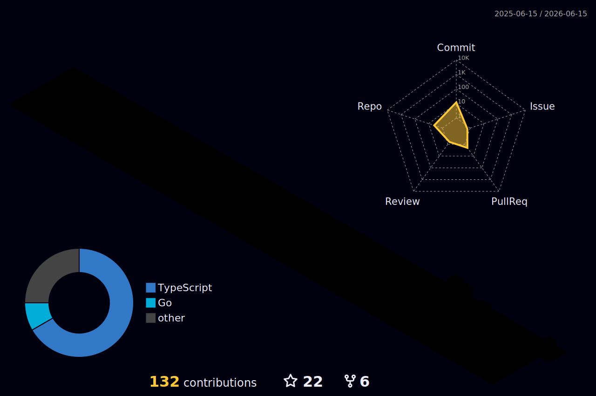

  <samp>HEAD OF PRODUCT ENGINEERING · ULTRALYTICS&ensp;<b>//</b>&ensp;LONDON · GMT&ensp;<b>//</b>&ensp;OPEN TO INTERESTING PROBLEMS</samp>

 

### <samp>01 // ORIENTATION</samp>

<samp>Eight years shipping mission-critical software at the intersection of AI research,
regulated systems, and platform engineering. Equally at home as a hands-on IC and as
the engineer leading the team. I prefer small teams, clearly bounded problems, and
expert users.</samp>

 

### <samp>02 // SELECTED WORK</samp>

<table>
  <tr>
    <td><samp><b><a href="https://prateeks.work/work/ultralytics-platform">ULTRALYTICS&nbsp;PLATFORM</a></b></samp></td>
    <td><samp>2025 — NOW</samp></td>
    <td><samp>The commercial computer-vision platform on top of a top-five open-source library. Built from scratch · 30,000+ users in the first two months.</samp></td>
  </tr>
  <tr>
    <td><samp><b><a href="https://prateeks.work/work/vektor-medical">VEKTOR&nbsp;MEDICAL</a></b></samp></td>
    <td><samp>2021 — 2023</samp></td>
    <td><samp>Arrhythmia-mapping UI for a 510(k)-cleared cardiology device. Named <a href="https://patents.google.com/patent/WO2024044719A1/en"><b>U.S. PATENT</b> WO2024044719A1</a> · 66% faster release cycles.</samp></td>
  </tr>
  <tr>
    <td><samp><b><a href="https://prateeks.work/work/avenda-health">AVENDA&nbsp;HEALTH</a></b></samp></td>
    <td><samp>2019 — 2021</samp></td>
    <td><samp>Prostate-cancer focal-therapy stack: cloud SaMD + embedded AI treatment planning. Two products shipped 0 → 100 inside a 510(k) pathway.</samp></td>
  </tr>
  <tr>
    <td><samp><b><a href="https://prateeks.work/work/dicom-explorer">DICOM&nbsp;EXPLORER</a></b></samp></td>
    <td><samp>2026</samp></td>
    <td><samp>Private, in-browser medical-imaging viewer with a self-hosted MedGemma 1.5 reading layer. Whole-study AI reads · nothing leaves your machine. <a href="https://dicom-explorer.prateeks.work">Try it</a> · <a href="https://www.npmjs.com/package/dicom-toolkit">dicom-toolkit on npm</a>.</samp></td>
  </tr>
</table>

<samp>→ <a href="https://prateeks.work/work">FULL ARCHIVE AT PRATEEKS.WORK/WORK</a></samp>

 

### <samp>03 // STACK</samp>

<samp><b>LANGUAGES</b></samp>

  
  
  
  
  
  
  
  
  
  

<samp><b>FRONTEND & UI</b></samp>

  
  
  
  
  
  
  
  
  
  
  
  

<samp><b>BACKEND & APIS</b></samp>

  
  
  
  
  
  
  

<samp><b>DATA</b></samp>

  
  
  
  
  
  
  
  
  

<samp><b>CLOUD & INFRA</b></samp>

  
  
  
  
  
  
  
  
  
  
  

<samp><b>AI & ML</b></samp>

  
  
  
  
  
  
  
  
  
  
  
  
  
  
  
  
  

<samp><b>REGULATED DELIVERY</b></samp>

  
  
  
  
  

 

### <samp>04 // ACTIVITY</samp>

 

### <samp>05 // WRITING</samp>

<samp><b>//</b>&ensp;<a href="https://prateeks.work/blog/dicom-explorer">DICOM Explorer: read your own MRI in the browser, privately, with self-hosted MedGemma 1.5</a> 
<b>//</b>&ensp;<a href="https://prateeks.work/blog">All writing → prateeks.work/blog</a></samp>

 

### <samp>06 // CONTACT</samp>

<samp><b>SITE</b>&emsp;&emsp;<a href="https://prateeks.work">prateeks.work</a> 
<b>MAIL</b>&emsp;&emsp;<a href="mailto:me@prateeks.work">me@prateeks.work</a> 
<b>LINK</b>&emsp;&emsp;<a href="https://linkedin.com/in/pbhatna/">linkedin.com/in/pbhatna</a></samp>
